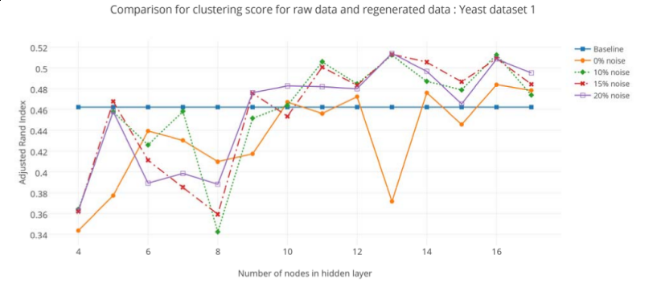
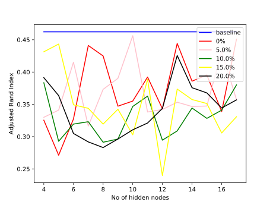

## Learning structure in gene expression data using deep architectures, with an application to gene clustering
##### by Aman Gupta, Haohan Wang, Madhavi Ganapathiraju

### Description
This paper uses denoising auto encoder as a pre-processing step to various supervised/unsupervised task on gene-expression data. Authors claim thatrRunning the data through denoising autoencoder significantly improves the results of tasks such as clustering.

### Brief explanation

#### Packages used
- __sklearn__ - for spectral clustering and adjusted rand index(for measuring the accuracy of clustering against the gold standard clustering)
- __numpy__ - various array operations
- __scipy__ - for k-means clustering
- __keras__ - for denoising autoencoder, SGD and sigmoid functions
- __matplotlib__ - for plotting the results

#### Hyperparameters

- __no of hidden nodes__ - [4,5,6,7,8,9,10,11,12,13,14,15,16,17]
- __error rate__ - [0, 0.05, 0.1, 0.15, 0.2]
- __learning rate__ - 0.1
- __number of epochs__ - 2000
- __batch size__ - 8

#### Datasets
- Yeast cell dataset 1 - `data/dataset1_normalised.txt`
- Yeast cell dataset 2 - `data/dataset2_normalised.txt`

#### Methodoogy
Adjusted rand score is used as the metric to compare the quality of the clustering. Higher the adjusted rand score, the better the clustering. The rand score of original (baseline) clustering is compared with the dataset obtained after running it through the denoising autoencoder with a a single hidden layer. Artificial noise it introduced to the data before putting it in autoencoder so only the most important features of the gene sequence is reproduced by the autoencoder.

### Hardware used
Core i3 4th Gen/4 GB/NVIDIA Geforce 820M with custom linux

### Base Requirements
1. Python 2.6
2. virtualenv
3. git

### Steps to reproduce the result

- get the source files

	`git clone https://github.com/piyushrungta25/Gene-clustering-using-denoising-autoencoders.git`

- change into the directory

	`cd denoising_autoencoder`

- make the virtualenv

	`virtualenv /path/to/virtual/env/`

- activate env

	`source /path/to/virtual/env/bin/activate`

- Install dependencies

	`pip install -r requirements.txt`

- Running the autoencoder

	`python train.py`

- Results are plotted in result.svg

### Results for dataset 1

##### Expected result

##### Obtained result

